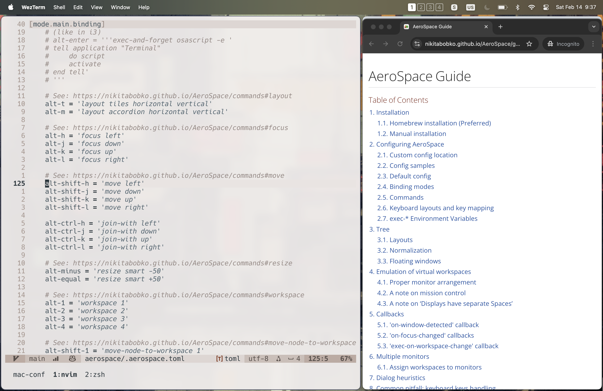

# MacConf

Config files exclusively for a great macOS experience. No universal tools here.



## Components

- **[Homebrew](https://brew.sh/)**: Package management
- **GNU Coreutils**: Linux compatibility
- **[Aerospace](https://github.com/nikitabobko/AeroSpace)**: Tiling window management
- **[Karabiner-Elements](https://karabiner-elements.pqrs.org/)**: Keyboard customization
- **[JankyBorders](https://github.com/FelixKratz/JankyBorders)**: Window borders
- **[Maccy](https://maccy.app/)**: Clipboard management
- **[Latest](https://max.codes/latest/)**: Software update outside of the App Store
- **[Shottr](https://shottr.cc/)**: Screenshot tool
- **[MonitorControl](https://github.com/MonitorControl/MonitorControl)**: Control external monitor brightness and volume
- **[WezTerm](https://wezterm.org/index.html)**: Terminal emulator

## Setup

Install `brew` and required packages:

```bash
make install
```

Log out and log back in, then start `Karabiner-Elements` and `Aerospace` for the first time. Set them to start at login. `Aerospace` will start the other apps on its own.

Link config files:

```bash
make link
```

Add all complex modifications called `keyd-port` in the `Karabiner-Elements` settings.

## Other Settings

- I usually change the Caps Lock modifier to Control in the system settings. Despite using `Karabiner-Elements`, in some key combinations Caps Lock may still got activated.

## AeroSpace

- **Opt-(1..4)**: Switch workspace
- **Opt-Shift-(1..4)**: Move selected window between workspaces
- **Opt-(h,j,k,l)**: Move focus between windows
- **Opt-Shift-(h,j,k,l)**: Switch window placement
- **Opt-Control-(h,j,k,l)**: Join window to node
- **Opt-minus**: Decrease window size
- **Opt-equal**: Increase window size
- **Opt-t**: Toggle tiled orientation
- **Opt-m**: Toggle accordion orientation
- **Opt-Shift-r**: Reload config
- **Opt-Enter**: Open _Wezterm_
- **Opt-w**: Open _Chrome_ with the default profile
- **Opt-Shift-w**: Open _Chrome_ with the second profile
- **Cmd-q/Opt-q**: Close the focused app instance (instead of the whole app)

## Karabiner-Elements

| Key          | Hold      | Tap       |
| ------------ | --------- | --------- |
| Caps Lock    | Control   | Escape    |
| Left Command | Command   | Backspace |
| Tab          | Nav Layer | Tab       |

### Nav Layer (hold Tab)

- **Tab-u,i,o,y**: Switch workspace (1..4)
- **Tab-h,j,k,l**: Left, Down, Up, Right
- **Tab-p**: Page Up
- **Tab-n**: Page Down
- **Tab-m**: Home
- **Tab-/**: End
- **Tab-,**: Word Left
- **Tab-.**: Word Right

## Other Keybindings

- **Cmd-Shift-1**: Screenshot of the entire screen
- **Cmd-Shift-2**: Screenshot of a selected area
- **Cmd-Shift-C**: Open Maccy popup, I usually change this to **Cmd-Shift-P**
